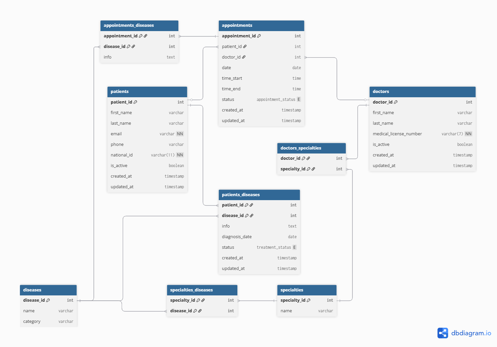

# Clinic-database-schema_idea
Relational database schema idea for Clinic (Patients, Diseases, Doctors, Appointments). Made in[ dbddiagram.](https://dbdiagram.io/)

## Schema visualisation

### Relations
In the database, one patient and one doctor can have many appointments. The other connections are many-to-many relationships that reflect real medical processes. Doctors have various specialities, and each speciality covers specific diseases. Additionally, the system allows assigning multiple conditions both to a specific visit and to the permanent medical history of the patient.
